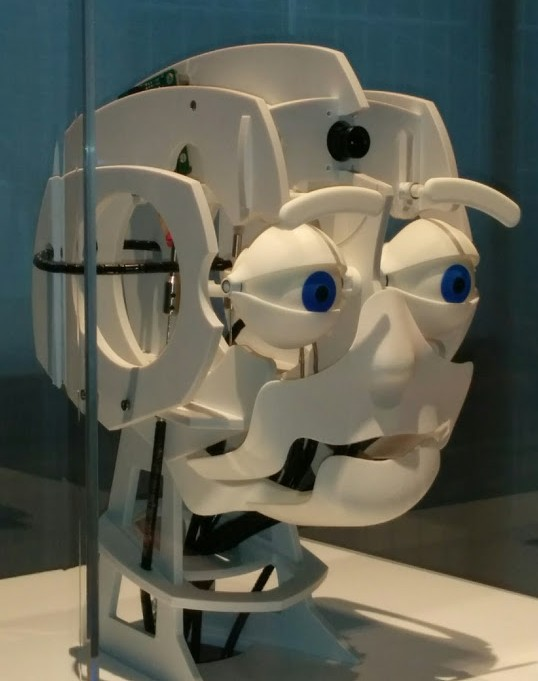
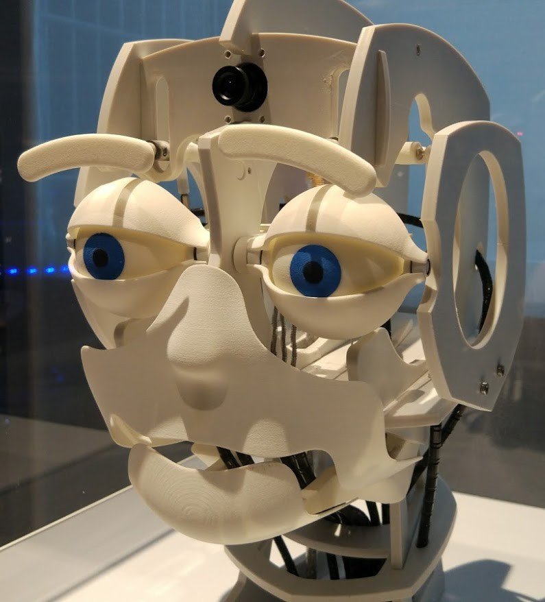
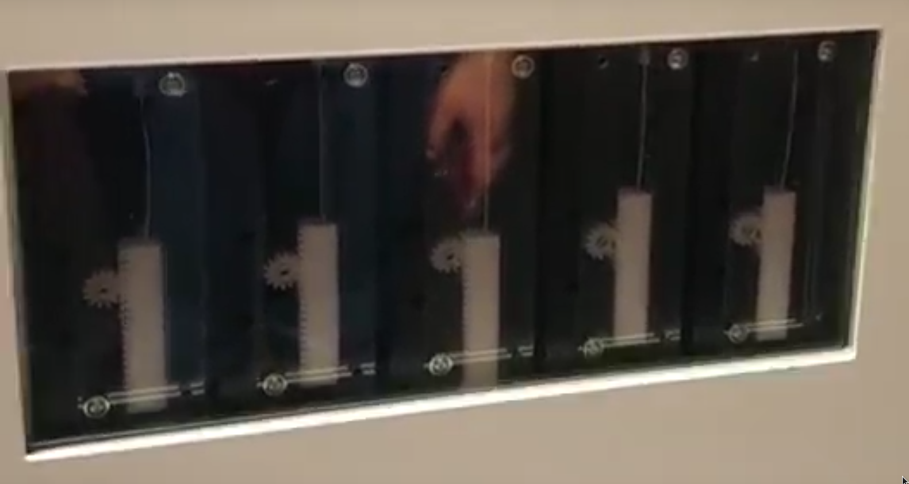

# Animatronic

En la exposición del del Parque de las ciencias lo llaman "Felix"

[Vídeo sobre el robot](https://www.youtube.com/watch?v=96ECx5YY3eg)

[Vídeo sobre su desarrollo](https://www.youtube.com/watch?v=6EbsyTpqZjY)

Desarrollado por [Archimedes Exibitions](http://www.archimedes-exhibitions.de/)

## Proyectos similares

### [Fritz: The robotic head](https://www.kerkits.com/products/fritz-the-robotic-head) 229€

[Open Animatronic Kit](https://www.tindie.com/products/madhephaestus/open-animatronics-kit-creature-head/) (149€)

##  Montajes

[Recopilación de proyectos de animatrónica en Instructables](http://www.instructables.com/howto/animatronic/)

## Modelos para imprimir

[Animatroic Eye Mechanism](http://www.thingiverse.com/thing:172505)

[Animatronic SunFlower](http://www.thingiverse.com/thing:1376933)

[Animatronic EyeBalls](http://www.thingiverse.com/thing:178632)

[Eye Mechanism](http://www.thingiverse.com/thing:1152248)

### posibles mecanismos:

El movimiento lo realizan servos que por medio de un mecanismo de rack y piñón mueven hilos de acero conectados a las piezas móviles

[servos 9g](http://www.thingiverse.com/thing:896781)

[miniservo](http://www.thingiverse.com/thing:1390193)

